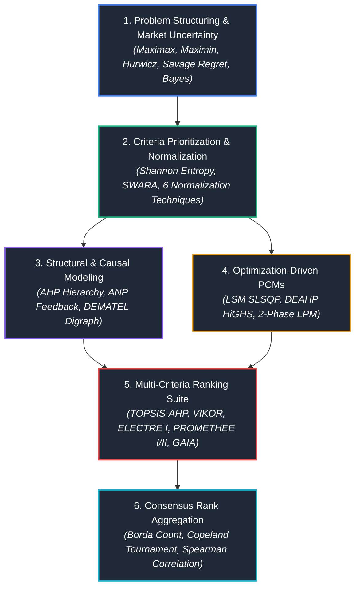

# Multi-Criteria Decision Analysis (MCDA) Framework
### An Applied Benchmark Suite of Classical and Modern MCDM Algorithms

---

## 📌 Executive Overview

Real-world engineering, industrial, and strategic decisions rarely depend on a single criterion. Decision makers constantly grapple with conflicting objectives (e.g., minimizing capital expenditures while maximizing safety and throughput) under stochastic or incomplete market information.

This repository provides an **end-to-end, reproducible computational framework** covering both foundational and state-of-the-art **Multi-Criteria Decision Analysis (MCDA)** and **Multi-Criteria Decision Making (MCDM)** paradigms. Spanning four integrated case studies, the suite moves from decision-making under uncertainty and mathematical weight-derivation models to network structural modeling and a comprehensive comparative benchmark of outranking and compromise ranking algorithms.

---

##  Academic Attribution & Provenance

* **Course:** Decision-Making Fundamentals
* **Academic Supervisor & Course Designer:** **Dr. Akbar Esfahanipour**
* **Institution:** Department of Industrial Engineering & Management Systems

---

##  Formal Case Specifications & Requirements

The rigorous mathematical problem statements, raw input matrices, and calibrated parametric constraints are documented in bilingual technical reports:

* 🇬🇧 **English Specification:** [`docs/case_specifications_en.pdf`](docs/case_specifications_en.pdf)
* 🇮🇷 **Persian Specification:** [`docs/case_specifications_fa.pdf`](docs/case_specifications_fa.pdf)

---

##  Methodological Architecture & Case Studies

### Case Study I: Decision Making Under Uncertainty & Attribute Weighting
* **Jupyter Notebook:** [`notebooks/01_uncertainty_and_weighting.ipynb`](notebooks/01_uncertainty_and_weighting.ipynb)
* **Topics Covered:**
  * **Decisions under Complete Uncertainty:** Maximax (Optimistic), Maximin / Wald (Pessimistic), Hurwicz Criterion ($\alpha$-sensitivity sweep from $0$ to $1$), Savage Minimax Regret (Opportunity Loss Matrix), and Laplace Principle of Insufficient Reason.
  * **Decisions under Risk:** Bayes Expected Monetary Value (EMV) evaluated over state probabilities ($P(S_1)=0.31, P(S_2)=0.45, P(S_3)=0.24$).
  * **Production Sensitivity Analysis:** Modeling the impact of a $\pm 30\%$ systematic forecasting discrepancy.
  * **Data Normalization Engine:** Vector (Euclidean), Linear Sum, Linear Max, Fuzzy Range (Min-Max), Standard Normal (Z-score), and Distance-to-Target (Centroid) transformations.
  * **Criteria Weighting:** Objective Shannon Entropy, Bayesian Prior Integration ($\mathbf{w}_0$), and SWARA (Step-wise Weight Assessment Ratio Analysis) derived from stakeholder consensus.

---

### Case Study II: Optimization-Driven Priority Vectors from PCMs
* **Jupyter Notebook:** [`notebooks/02_pcm_optimization_models.ipynb`](notebooks/02_pcm_optimization_models.ipynb)
* **Topics Covered:**
  * **Spectral Analysis:** Saaty's Principal Eigenvector method ($\mathbf{A}\mathbf{w} = \lambda_{\max}\mathbf{w}$), Consistency Index ($CI$), and Consistency Ratio ($CR$).
  * **Classical Approximations:** Arithmetic mean, geometric mean (Logarithmic Least Squares), and row-sum normalization.
  * **Least Squares Method (LSM):** Non-linear optimization minimizing sum of squared ratio residuals $\sum \sum (a_{ij} - w_i/w_j)^2$ via Sequential Least Squares Programming (`SLSQP`).
  * **Data Envelopment Analysis AHP (DEAHP):** Modeling each criteria row as a Decision-Making Unit (DMU) with virtual multipliers using linear programming (`HiGHS`).
  * **Linear Programming Method (LPM):** Two-Phase Goal Programming minimizing $L_1$ absolute deviations $\sum (d_{ij}^+ + d_{ij}^-)$ followed by max-min equity maximization.

---

### Case Study III: Structural, Network, and Causal Modeling
* **Jupyter Notebook:** [`notebooks/03_structural_ahp_anp_dematel.ipynb`](notebooks/03_structural_ahp_anp_dematel.ipynb)
* **Topics Covered:**
  * **Analytic Hierarchy Process (AHP):** 3-tier hierarchy decomposition for vehicle selection across 4 main criteria and 4 sub-criteria. Verification of local/global consistency ($CR < 0.1$).
  * **Analytic Network Process (ANP):** Capturing interdependencies and feedback loops between alternatives and criteria clusters. Formulation of the Unweighted Supermatrix, Column-Stochastic Weighted Supermatrix, and Markov Chain stationary distribution convergence for the Limiting Supermatrix ($\mathbf{W}^\infty$).
  * **DEMATEL (Decision Making Trial and Evaluation Laboratory):** Transforming direct expert judgments ($\mathbf{Z}$) into the Total Relation Matrix ($\mathbf{T}$). Computation of Prominence ($D+R$) and Net Causal Relation ($D-R$) with automated digraph mapping via `NetworkX`.

---

### Case Study IV: MCDA Ranking Benchmark & Meta-Aggregation
* **Jupyter Notebook:** [`notebooks/04_mcda_ranking_and_aggregation.ipynb`](notebooks/04_mcda_ranking_and_aggregation.ipynb)
* **Topics Covered:**
  * **TOPSIS-AHP:** Vector normalization, Euclidean distance to Positive/Negative Ideal Solutions ($d^+, d^-$), and Closeness Coefficient ($CC_i$).
  * **VIKOR:** Linear compromise programming computing Group Utility ($S_i$), Individual Regret ($R_i$), and Compromise Index ($Q_i$) under weight of strategy $v=0.5$.
  * **ELECTRE I:** Outranking dominance analysis using Concordance ($C$) and Discordance ($D$) threshold filtering to identify the non-dominated Kernel set.
  * **PROMETHEE I & II:** Generalized linear preference functions, positive leaving flows ($\phi^+$), negative entering flows ($\phi^-$), and net outranking flow ($\phi$).
  * **Visual PROMETHEE (GAIA Plane):** 2D Principal Component Decomposition (PCA) of unicriterion net flows visualizing criteria conflicts and the decision axis ($\pi$).
  * **Consensus Rank Aggregation:** Mean Rank, Borda Count Algorithm, Copeland Pairwise Tournament Method, and Spearman Rank Correlation matrix.

---

##  Consolidated Benchmark Results

The multi-criteria algorithms were evaluated on the strategic vehicle selection problem ($V_1$: Economy, $V_2$: Balanced Family, $V_3$: High Performance/Safety) using the synthesized AHP criteria weights:

| Alternative | TOPSIS-AHP | VIKOR | ELECTRE I | PROMETHEE II | Borda Count | Copeland Tournament | **Consensus Rank** |
| :--- | :---: | :---: | :---: | :---: | :---: | :---: | :---: |
| **Vehicle 1 ($V_1$)** | 3 | 3 | Non-Dominated | 3 | 3 | 3 | **3rd Place** |
| **Vehicle 2 ($V_2$)** | 2 | 1 | **Kernel (Winner)** | 2 | 2 | 2 | **2nd Place** |
| **Vehicle 3 ($V_3$)** | 1 | 2 | Non-Dominated | 1 | 1 | 1 | **1st Place** |

> **Key Takeaway:** Despite differing mathematical philosophies (ideal-distance vs. compromise vs. outranking flows), the methods exhibit strong rank correlation ($\rho > 0.85$). $V_3$ achieves top ranking in TOPSIS, PROMETHEE II, and Borda due to superior safety and technical performance, while $V_2$ emerges as the consensus compromise winner under VIKOR and ELECTRE I.

---

##  Key Engineering & Theoretical Takeaways

1. **Compensatory vs. Outranking Dynamics:** Distance-based methods (TOPSIS) allow high performance in one criterion (e.g., safety) to fully compensate for deficiencies in another (e.g., price). In contrast, outranking methods (ELECTRE I) enforce strict non-compensatory discordance/veto thresholds, preventing extreme trade-offs.
2. **Eigenvector vs. Mathematical Programming in PCMs:** While Saaty's eigenvector method remains standard, non-linear Least Squares (LSM) and Linear Programming (LPM) provide actionable alternatives when seeking minimum residual variance or when handling interval-valued judgments.
3. **Limiting Behavior in ANP:** Cyclic networks between criteria and alternatives must satisfy column-stochasticity to ensure that the limiting supermatrix power series $\mathbf{W}^{2k+1}$ converges to a unique stationary Markov distribution.
4. **Visual Decision Support via GAIA:** Projecting multi-dimensional preference flows onto the GAIA plane reveals latent conflicts between criteria vectors and shows the sensitivity of the optimal decision axis ($\pi$) to weight adjustments.

---

##  Tech Stack & Computational Tools

* **Core Programming:** Python 3.10+
* **Data Manipulation & Matrices:** `NumPy`, `Pandas`
* **Mathematical Programming & Linear Algebra:** `SciPy` (`scipy.optimize`, `scipy.linalg`, `scipy.stats`)
* **Machine Learning & Decomposition:** `Scikit-Learn` (`PCA` for GAIA projection)
* **Graph & Network Analysis:** `NetworkX`
* **Data Visualization:** `Matplotlib`, `Seaborn`
* **Specialized Decision Engineering Software:**
  * Microsoft Excel & OpenSolver / Excel Solver Add-in
  * Expert Choice (Hierarchical AHP)
  * Super Decisions (Network ANP)
  * Visual PROMETHEE (Preference Outranking & GAIA Analysis)
* **Document Preparation:** LaTeX / XeLaTeX (`xepersian`)

